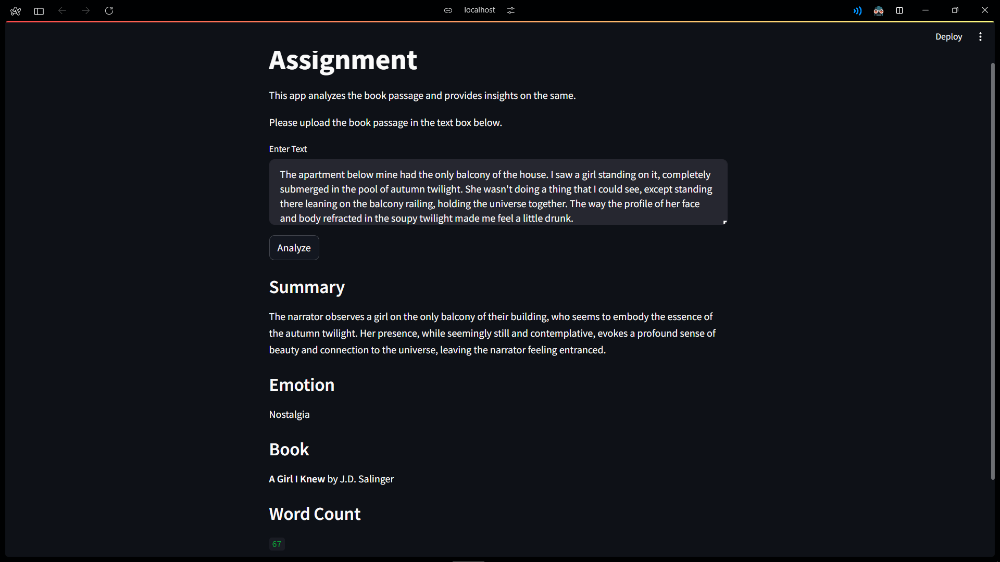

# Assignment for Inventic AI

## Table of Contents
- [Problem Statement](#problem-statement)
- [Tech Stack](#tech-stack)
- [Installation](#installation)
- [Demo](#demo)

## Problem Statement
Write a Python script that analyzes a given book passage (provided below) and provides the
following information:
1. The total number of words in the passage.
2. The predominant emotion conveyed in the passage (e.g., joy, sadness, anger).
3. 2-3 possible books the passage might be from.
4. A summary of the passage in 2-3 sentences.

## Tech Stack
- Python
- Langchain
- Streamlit

## Installation
1. Clone the repository
```bash
git clone https://github.com/suryanshgupta9933/inventic-assignment.git
```
2. Install the dependencies
```bash
pip install -r requirements.txt
```
3. Rename the `.env.example` file to `.env` and update the values
```bash
cp .env.example .env
```
4. Run the Streamlit app
```bash
streamlit run app.py
```

## Demo
